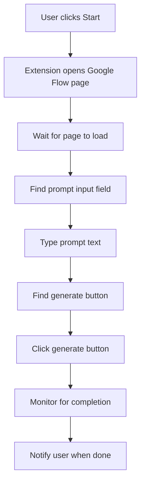

# 🎬 Google Flow Auto Video Generator Extension

Extension សម្រាប់ Auto Generate Video ពី Google Flow Project ដោយស្វ័យប្រវត្តិ

## ✨ Features / មុខងារ

- 🎯 Auto generate videos from Google Flow
- 📝 Input prompt and URL easily  
- 🔄 **Multiple Prompts Queue Mode** - Generate multiple videos in sequence
- 🔄 Auto retry on errors
- 🔔 Notification when complete
- 💾 Save your settings automatically
- 🧪 Test link and test page buttons
- 📊 Real-time progress tracking for queues

## 📦 Installation / ការដំឡើង

### Method 1: Load Unpacked Extension (Chrome/Edge)

1. **Open Extension Manager:**
   - Chrome: `chrome://extensions/`
   - Edge: `edge://extensions/`

2. **Enable Developer Mode:**
   - Toggle the "Developer mode" switch in the top right

3. **Load Extension:**
   - Click "Load unpacked"
   - Select the extension folder (`New folder (29)`)

4. **Extension Ready!**
   - You should see the extension icon in your browser toolbar
   - Click it to open the popup

### Method 2: Drag and Drop (Future)
- Pack the extension to .crx file first
- Drag to extension page

## 🚀 Usage / របៀបប្រើប្រាស់

### Basic Usage:

1. **Click Extension Icon** ចុចលើ Extension Icon
   
2. **Select Mode:**
   - **Single Prompt**: Generate one video at a time
   - **Multiple Prompts (Queue)**: Generate multiple videos in sequence
   
3. **Enter Google Flow URL:**
   ```
   https://labs.google/fx/tools/flow/project/YOUR_ID_HERE
   ```
   
4. **Enter Your Prompt(s):**
   
   **Single Mode:**
   - Type one prompt
   - Example: "A cat playing piano in space"
   
   **Queue Mode:**
   - Type one prompt per line
   - Example:
   ```
   A cat playing piano in space
   A dog dancing on the moon
   A bird singing in the ocean
   ```
   
5. **Click "Start Auto Generate":**
- **Delay between prompts:** (Queue mode only) Time to wait between each generation (5-300 seconds)
   - Extension will automatically:
     - Open or navigate to Google Flow
     - Enter your prompt(s)
     - Press Enter or click generate button
     - Monitor for completion
     - (Queue mode: Process all prompts in order)

### Test Buttons:

- **🔗 Test Link:** Check if URL is accessible
- **📄 Test Page:** Open URL in new tab to verify

### Settings:

- **Auto retry on error:** Retry up to 3 times if generation fails
- **Notify when complete:** Browser notification when done

## 🎯 How It Works / របៀបដំណើរការ



## 📁 File Structure

```
New folder (29)/   # Extension configuration
├── popup.html            # UI interface
├── popup.css             # Styles
├── popup.js              # Popup logic & queue handling
├── content.js            # Page automation & queue processor
├── background.js         # Background tasks
├── icon16.png            # Icon 16x16
├── icon48.png            # Icon 48x48
├── icon128.png           # Icon 128x128
├── README.md             # This file
├── QUICK_START.md        # Quick start guide
├── QUEUE_MODE_GUIDE.md   # Multiple prompts guide
├── TEST_INSTRUCTIONS.md  # Testing instructions
├── generate_icons.py     # Icon generator script
└── generate-icons.html   # Icon generator HTML128
└── README.md          # This file
```

## ⚙️ Configuration

Settings are auto-saved to browser storage:
- Last used URL
- Last used prompt  
- Auto retry preference
- Notification preference

## 🐛 Troubleshooting

### Extension not working?

1. **Refresh the page:**
   - Reload Google Flow page
   - Try clicking Start again

2. **Check URL:**
   - Make sure URL is correct
   - Must be `https://labs.google/fx/tools/flow/project/...`

3. **Check Console:**
   - Right-click → Inspect → Console
   - Look for error messages

4. **Reload Extension:**
   - Go to `chrome://extensions/`
   - Click reload icon on this extension

### Generation fails?

- Enable "Auto retry" in settings
- Make sure you're on the correct page
- Check if Google Flow UI has changed
- Wait a bit and try again

## 🔒 Permissions

This extension requires:
- `activeTab`: To interact with Google Flow page
- `scripting`: To inject automation script
- `storage`: To save your settings
- `https://labs.google/*`: To access Google Flow

## 🎨 Customization

### Change icons:
Replace `icon16.png`, `icon48.png`, `icon128.png` with your own images

### Modify selectors:
If Google changes their UI, update selectors in `content.js`:
```javascript
const promptSelectors = [
  // Add new selectors here
];
```

## 📝 Notes / ចំណាំ

- Works best on Google Chrome and Microsoft Edge
- Requires internet connection
- Google Flow must be accessible
- May need updates if Google changes their UI

## 🔄 Updates

To update the extension:
1. Modify files as needed and mode
- **Test first:** Use "Test Page" to verify URL before generating
- **Single vs Queue:** Use single for testing, queue for batch generation
- **Multiple generations:** Just change prompt and click Start again
- **Queue mode:** Enter prompts one per line, set appropriate delay (10-30s recommended)
- **Background work:** Can close popup, extension will still monitor
- **Monitor progress:** Keep console open (F12) to see detailed progress
## 💡 Tips

- **Save time:** Extension remembers your last prompt
- **Test first:** Use "Test Page" to verify URL before generating
- **Multiple generations:** Just change prompt and click Start again
- **Background work:** Can close popup, extension will still monitor

## ⚠️ Limitations

- Depends on Google Flow's UI structure
- May break if Google updates their interface
- Requires manual icon creation (currently placeholders)
- Internet connection required

## 🛠️ Development

To modify this extension:

1. Edit files in the extension folder
2. Reload extension in browser
3. Test changes
4. Repeat

### Key files to modify:
- `content.js`: Change automation logic
- `popup.html/css/js`: Change UI
- `manifest.json`: Change permissions/settings

## 📞 Support

If you encounter issues:
1. Check console for errors
2. Verify Google Flow page structure
3. Update selector patterns in code
4. Disable/re-enable extension

## 🎓 Learning Resources

- [Chrome Extension Docs](https://developer.chrome.com/docs/extensions/)
- [Manifest V3 Guide](https://developer.chrome.com/docs/extensions/mv3/)
- [Content Scripts](https://developer.chrome.com/docs/extensions/mv3/content_scripts/)

---

**Created for auto-generating videos from Google Flow** 🚀

**Version:** 1.0.0  
**Last Updated:** February 2026
